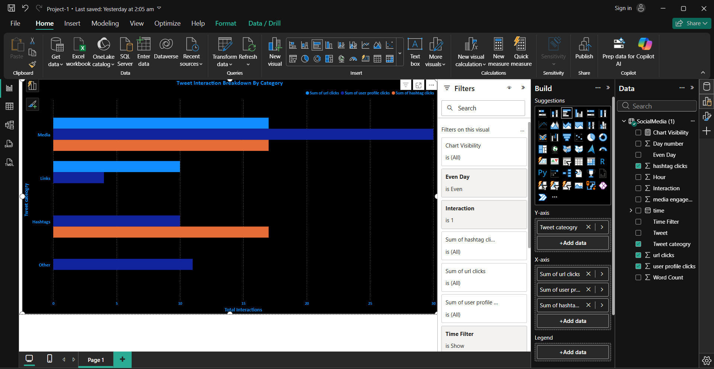
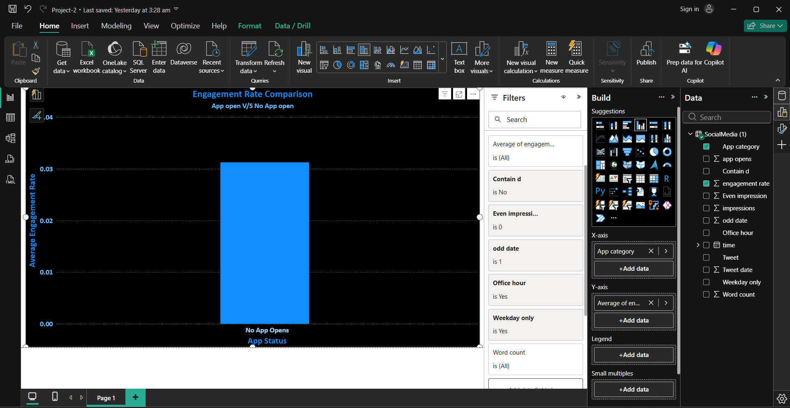
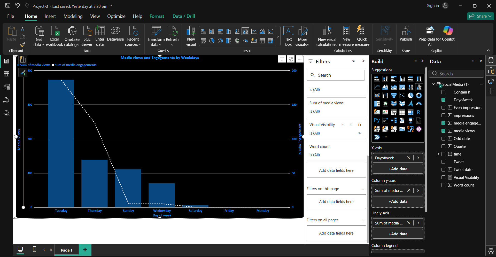
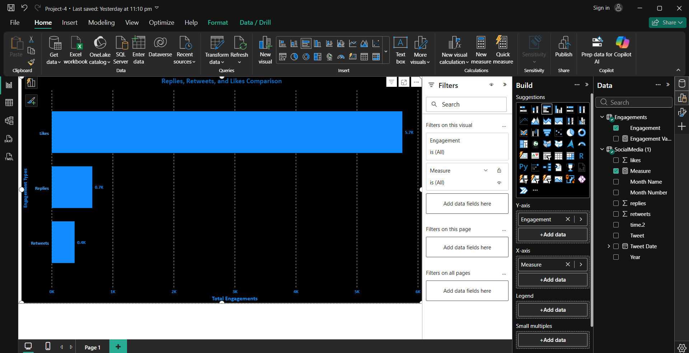
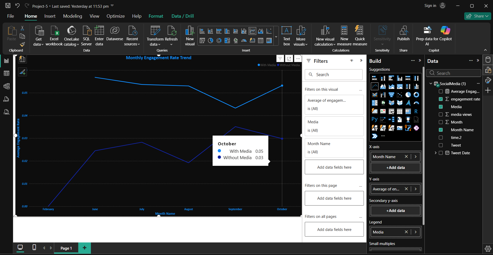
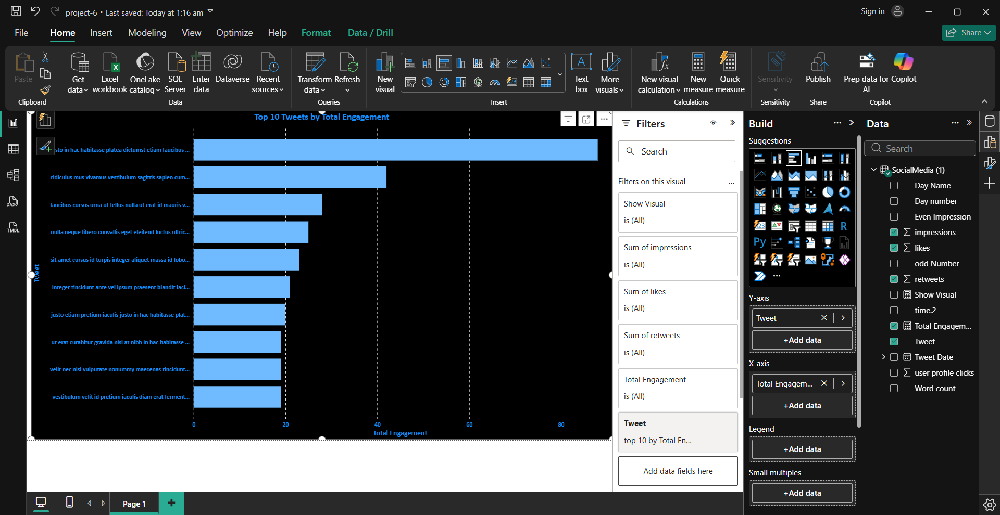

# Power BI Projects

This repository contains Power BI dashboards developed using a social media dataset.

## Dashboards

1. Tweet Interaction Breakdown by Category
2. Engagement Rate comaprison
3. Media Interaction by Day
4. Replies, Retweets and Likes Comparison
5. Monthly Engagement Trend
6. Top 10 Tweets by Engagement

## Tools Used

- Power BI
- Power Query
- DAX

## Dashboard Screenshots

### Tweet Interaction Breakdown

### Engagement Rate Comparison
.

### Media Interaction by Day

### Replies, Retweets and Likes

### Monthly Engagement Trend

### Top 10 Tweets by Engagement

## Author

**Shubham Tiwari**
